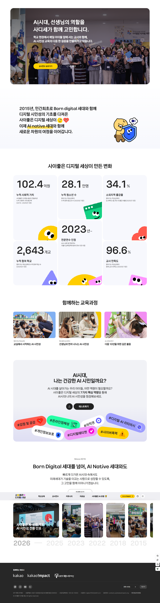
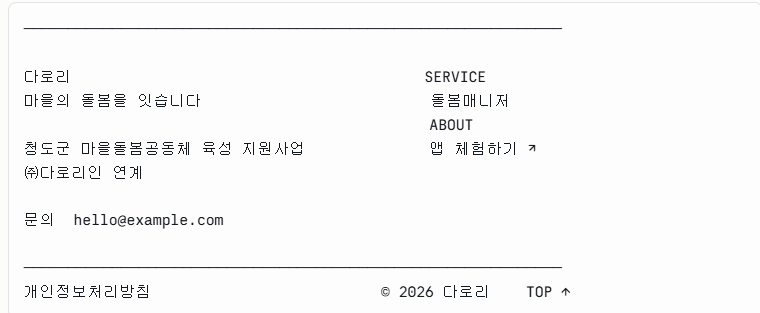

# [웹] 웹사이트 기획(2026.8.13)

**1. 기획 개요**

1-1. 사이트의 목적

> **이 서비스가 무엇이고 왜 필요한지 이해시키고, 다음 행동까지 이어주는 것.**
> 

'서비스'는 앱 하나만을 가리키지 않으며 마을 안에서 돌봄매니저를 길러내고, 그 사람을 도움이 필요한 이웃과 연결하고, 활동한 만큼 활동비를 지급하는 구조 전체를 뜻하고, 사이트에서도 사업과 앱을 함께 다룹니다.

1-2. 기획 방향

청도의 마을돌봄 사업과 그 사업을 운영하기 위해 만든 앱을 한 흐름으로 엮어 보여주는 서비스 사이트. 사업이 사람을 길러내고, 앱이 그 사람을 이웃과 잇고, 활동한 만큼 활동비로 돌아오는 순환이 사이트의 중심 뼈대다. 홈에서 이 구조 전체를 보여준 뒤 돌봄을 받는 쪽과 돌봄을 하는 쪽으로 페이지가 나뉘고, 아래로 내려가면서 돌봄 신청이나 돌봄매니저 지원으로 이어진다. 대부분 휴대폰으로 링크를 받아 한 번 훑고 나가는 방문이므로 첫 화면에서 이해가 시작된다. 청도는 배경에 두고 서비스를 주어로 세워, 사이트 자체가 팀의 결과물을 보여주는 포트폴리오가 된다.

[웹] 소개 / 왜 필요한지 설득 → [앱] 실제 처리

SERVICE ─────────→ 요청 작성 / 데모 체험

돌봄매니저 ────────→ /apply 지원서.

**2. 메시지**

> **돌봄이 필요한 사람도, 돌볼 수 있는 사람도 같은 마을 안에 있습니다.**
> 

돌봄 인력을 외부에서 데려오는 대신 마을 안에서 순환시킨다. 돌봄 공백이 메워지는 동시에 마을에 일자리가 남는다는 점이 이 서비스의 핵심이고, 사이트 전체가 이 메시지를 향한다.

---

 **3. 정보 구조** 

<aside>

[다로리(서비스명)]                                              SERVICE           돌봄매니저          ABOUT          [ DEMO ↗ ]

</aside>

- `/` — **홈(다로리-서비스명)** / 서비스 전체를 훑는 랜딩
- `/service` — **SERVICE** / 돌봄을 받는 사람을 위한 안내
- `/manager` — **돌봄매니저** / 돌봄을 하는 사람을 위한 안내
- `/about` — **ABOUT** / 시작 배경, 파트너, 팀
- `DEMO ↗(앱 체험하기)`전 페이지 우상단 고정. 새 탭으로 앱 로그인 화면에 연결한다. 데모 계정을 이용하여 어느 페이지에서든 실제 화면으로 넘어갈 수 있도록 설계

**각 페이지가 다루는 것**

- **홈**은 서비스 전체를 훑는 랜딩. 문제 상황부터 순환 구조, 앱 화면 등 간결하게 핵심만 담아 아래로 이어진다

레퍼런스 :

- **SERVICE**는 돌봄을 신청하는 사람을 위한 페이지. 받을 수 있는 도움의 종류, 신청부터 방문까지의 절차, 활동이 기록되는 방식, 운영 화면을 다룬다
- **돌봄매니저**는 활동을 시작하려는 사람을 위한 페이지. 어떤 일인지, 지원부터 활동 승인까지의 단계, 활동비를 받는 흐름, 활동 지역과 자주 묻는 질문을 다룬다
- **ABOUT**은 서비스의 배경. 시작한 계기, 청도군·다로리인과의 연계, 우리가 만든 시스템, 팀 소개로 이어진다
- 네 카테고리 모두 자체 히어로를 갖고 아래로 이어지는 단일 스크롤. 카데고리별 하위 메뉴는 없음

---

**4. 페이지별 상세**

표기 — **[요소]** 화면 구성 / **(규칙)** 기획 규칙 / `/ 라벨` 섹션 라벨 / 인용문 실제 노출 카피(카피 문구는 변경되거나 매 섹션에 들어가지 않을 수 있음)

### 홈 `/`

A-1. 히어로

<aside>

청도군 마을돌봄공동체 육성 지원사업 · ㈜다로리인 연계

**돌봄이 필요한 사람도,**

**돌볼 수 있는 사람도**

**같은 마을 안에 있습니다**

다로리는 그 둘을 잇습니다. 돌봄은 이웃에게, 일은 마을에.

[ SERVICE → ] [ 돌봄매니저 지원하기 ]

</aside>

- **[요소]** 3행 카피
- **[요소]** 배경 — 읍·면 경계선을 옅게 깐 추상 그래픽
- **[요소]** 상단 사업 연계 표기 1행, CTA 2개

- A-2. `/ 마을의 하루`

> **이런 순간에 도움이 필요해요**
> 
- **[요소]** 카드 3장 (아이콘 + 제목 + 설명)
    - **병원 가는 길** — 버스는 하루 세 대, 혼자 나서기엔 먼 길이에요
    - **하교 후 세 시간** — 부모님이 돌아오기 전까지 아이는 혼자 있어요
    - **혼자 차리는 저녁** — 반찬 한 가지가 하루를 바꾸기도 해요
- **(규칙)** 크지 않지만 자주 생기는 도움에 초점을 맞춘다. 이 서비스가 채우는 자리를 구체적인 상황으로 보여주는 섹션이다

A-3. `/ 다로리가 도는 방식` — 홈에서 가장 큰 자리

> **마을 안에서 돌봄이 돌아가요**
> 

**[요소]** 원형 순환 도식 4단계

<aside>

① 마을에 사는 사람이
돌봄매니저가 됩니다
↘
④ 그 소득이 ② 앱으로 필요한
마을에 남습니다 이웃과 연결됩니다
↖ ↙
③ 활동한 만큼
활동비를 받습니다

</aside>

- **[요소]** 하단 마무리 — **돌봄의 공백은 메워지고, 일자리는 마을에 남습니다.**
- **(규칙)** ①④는 사업 영역, ②③은 서비스 영역. 사람을 길러내는 단계부터 활동비가 돌아오는 단계까지를 한 그림으로 보여준다. 홈에서 가장 넓은 면적과 여백을 준다

A-4. `/ 돌봄 서비스`

> **필요한 도움을 요청하면 매니저가 찾아와요**
> 
- **[요소]** 앱 화면 3컷 가로 배치 — 요청 보내기 / 방문 시간 확정 / 활동 완료
- **[요소]** 각 화면 한 줄 캡션, `SERVICE 자세히 보기 →`

A-5. `/ 돌봄매니저`

> **이웃을 돕고 활동비를 받는 일이에요**
> 
- **[요소]** 3행 요약 — 살고 있는 마을에서 활동해요 / 교육을 마치면 시작할 수 있어요 / 활동한 만큼 활동비를 받아요
- **[요소]** `돌봄매니저 알아보기 →`

~~A-6. `/ 함께하는 곳 (선택)`~~

> **~~청도군과 카카오임팩트가 함께합니다~~**
> 
- **~~[요소]** 로고 카드 2장(청도군 / ㈜다로리인) + 각 2~3행 설명~~
- **~~(규칙)** 여백은 그렇게 많진 않게 시각적인 카드요소로 크게 간단히~~

~~A-7. `/ 문의`~~

> **~~우리 마을에도 필요하다면 연락 주세요~~**
> 
> 
> ~~도입이나 협업이 궁금하시면 언제든 메일로 연락 주시면 됩니다.~~
> 
- **~~[요소]** 메일 버튼 1개~~
- **~~(규칙)** 협업·도입 문의는 이 섹션과 푸터에서 받는다.~~

- A-6과 A-7은 내용은 추가되지만 실질적인 여백은 많이 차지하지 않게 추가하는 것으로 생각하고 있는데, 너무 많다 싶으면 A-6과 A-7은 각각 Service 카테고리와 푸터가 대신하므로 선택적으로 제외시키는 것이 좋을 것 같다.

### B. SERVICE `/service`

B-1. 히어로

> **가까운 이웃이 찾아갑니다**
> 
- **[요소]** 앱 화면 이미지 + `[ DEMO ↗ ]`

B-2. `/ 도움 종류`

> **이런 도움을 요청할 수 있어요**
> 
- **[요소]** 카드 5장 (제목 + 예시 한 줄)
    - **병원·이동 라이딩** — 보건소나 병원까지 차로 모셔다드려요
    - **동행** — 장 보기, 관공서 방문 등 함께 다녀와요
    - **집안일 도움** — 청소, 정리 등 손이 필요한 일을 도와드려요
    - **식사 지원** — 반찬을 만들거나 배달해드려요
    - **그 외** — 하교 후 돌봄, 말벗 등 필요한 도움을 적어주세요
- **(규칙)** 카드마다 실제 활동 예시를 붙인다. 어디까지 부탁할 수 있는지 감이 잡히게 한다

B-3. `/ 이용 방법`

> **신청부터 방문까지 네 단계**
> 
- **[요소]** STEP 1~4와 각 단계 앱 화면
1. **어떤 도움이 필요한지 고르기** — 도움 종류와 원하는 날짜·시간을 선택해요
2. **매니저가 시간을 맞춰요** — 시간이 어려우면 다른 시간을 제안하고, 이용자가 확정하면 정해져요
3. **정해진 시간에 방문** — 매니저가 직접 찾아와 활동을 진행해요
4. **활동 기록** — 오늘 무엇을 했는지 기록으로 남아요
- **[요소]** STEP 2에 강조 박스 — **"이 시간에 꼭 가야 해요"를 켜두면 시간은 바뀌지 않아요.**
- **(규칙)** 위 강조 박스는 기능 설명에 묻지 않고 따로 꺼내 보여준다

B-4. `/ 활동 기록`

> **모든 활동은 기록으로 남아요**
> 
- **[요소]**
    - 도착한 시각과 위치가 자동으로 기록돼요
    - 무엇을 했는지 사진과 함께 남아요
    - 남은 기록은 운영자가 확인해요
    - 약속한 시간은 임의로 바뀌지 않아요
- **(규칙)** 낯선 사람이 집에 오는 일에 대한 걱정을 덜어주는 섹션. GPS 인증과 활동일지, 운영자 검토를 이용자 입장의 문장으로 묶는다

B-5. `/ 운영`

> **활동일지는 운영자가 검토해요**
> 
- **[요소]** 관리자 대시보드 실화면
    - 읍·면별 수요·매니저 배치 지도
    - 활동일지 검토
    - 예산 집행과 활동비 정산
- **(규칙)** 서비스가 실제로 굴러가는 시스템이라는 것을 운영 화면으로 보여주는 섹션

B-6. CTA

- **[요소]** `[ DEMO ↗ ]`와 돌봄 요청 안내

---

### C. 돌봄매니저 `/manager`

C-1. 히어로

> **마을에서 이웃을 돕는 일을 해요**
> 
- **[요소]** 모집 상태 배지, `[ 지원하기 ]` `[ 모집 안내 ]`

C-2. `/ 하는 일`

> **어떤 일을 하나요**
> 
- **[요소]** 활동 종류 — 병원 동행, 하교 후 돌봄, 집안일, 말벗
- **[요소]** 본인에게 배정된 요청만 표시되고, 일정이 안 맞으면 다른 시간을 제안할 수 있다는 안내

C-3. `/ 지원 자격`

> **이런 분을 찾고 있어요**
> 
- **[요소]** 3항목
    - 청도군 읍·면에 살고 계신 분
    - 주중에 몇 시간을 낼 수 있는 분
    - 자차가 있으면 이동 돌봄까지 가능해요
    

C-4. `/ 지원 절차`

> **지원부터 첫 활동까지 다섯 단계**
> 

STEP 1 STEP 2 STEP 3 STEP 4 STEP 5

지원서 작성 → 서류 확인 → 교육 이수 → 활동 승인 → 활동 시작

applied ───────────────── trained ──── active

C-5. `/ 활동비`

> **활동한 만큼 활동비를 받아요**
> 
- **[요소]** 활동 → 일지 작성 → 검토 → 월별 정산 → 출금 신청
- **[요소]** 활동 1회 기준 단가 표기

C-6. `/ 활동 지역`

> **사는 곳 가까이에서 활동해요**
> 
- **[요소]** 읍·면 지도, 지역 선택 안내

C-7. `/ 자주 묻는 질문`

> **자주 묻는 질문**
> 
- **[요소]** 아코디언 5~6문항 — 자차가 없어도 되는지, 교육은 얼마나 걸리는지, 활동비는 언제 들어오는지, 일정은 직접 정하는지, 활동을 못 하는 달이 있어도 괜찮은지

---

### D. ABOUT `/about`

D-1. `/ 시작`

> **작은 일손에서 돌봄으로**
> 
- **[요소]** 3~4문단. 방향을 옮기게 된 과정
- **(규칙)** 서비스가 지금의 형태를 갖게 된 과정을 담는 섹션

D-2. `/ 함께하는 곳`

> **연세대 테크포임팩트 캠퍼스 학생들과 청도군, 다로리인이 함께합니다**
> 
- **[요소]** 사업 설명 4~5행 / 다로리인 설명 4~5행 (카페 다로리, 마을학교, 마을쌤·맘셰프 양성)
- **(규칙)** 사업과 파트너를 이해하는 데 필요한 만큼 다룬다

~~D-3. `/ 우리가 만든 것`~~

> **~~돌봄이 이어지도록 구조를 만들었어요~~**
> 
> 
> ~~요청과 매칭, 활동 인증, 일지, 정산까지 한 흐름으로 이어지게 설계했습니다.~~
> 
- **~~[요소]** 각 기능이 왜 필요했는지~~
- **~~(규칙)** 기능을 나열하기보다 그렇게 설계한 이유를 쓴다. 정산은 봉사가 아니라 일로 만들려면 돈이 흐르는 구조가 있어야 했다는 이야기로 풀어 홈의 순환 간단한 시각 도식과 이어준다~~

---

### 푸터(사이트 하단 정보섹션)

## 추가내용 (about 부분

### D. ABOUT `/about`

D-1. `/ 시작`  (기존 유지)

D-2. `/ 만든 사람들`  ← 신규. ABOUT에서 가장 넓은 자리

> **DOUM을 만든 포로리팀이에요**

- **[요소]** 리드 문단 3문장 (아래 카피안)
- **[요소]** 팀원 이름 5명 — 가나다순
      김주은 · 박휘주 · 이예슬 · 정승환 · 정채윤
- **(규칙)** 역할(기획/디자인/개발)을 표기하지 않는다.
  보는 사람에게 정보 가치가 낮고 팀을 분업 단위로 쪼개 보이게 한다.
- **(규칙)** 이름 옆에 자기소개를 붙이지 않는다. 다만 나중에 한 줄씩
  추가될 수 있는 레이아웃으로 짠다. (카드 안 여백을 미리 확보)
- **(규칙)** 사진을 넣지 않는다. 없다.
- **(규칙)** D-1에서 이미 다룬 "방향이 바뀐 과정"을 여기서 반복하지 않는다.
  이 섹션은 팀이 무엇을 만들었는지에만 집중한다.
- **(규칙)** 팀명 '포로리'는 이전 프로젝트명에서 온 팀 이름이고
  서비스명 DOUM과 다르다. 문장에서 둘이 헷갈리지 않게 쓴다.

**카피안**

우리는 DOUM을 만든 포로리팀이에요(큰글씨 헤드글씨)

저희는 연세대학교 테크포임팩트 캠퍼스에서 만난 다섯 명이에요.
청도에 다녀오고 나서 만들고 싶은 것이 많아졌어요.

어떻게 하면 어르신들이 편하게 도움을 청하실 수 있을지,
마을에서 오간 도움 하나가 어떻게 다음으로 이어질 수 있을지,
오래 이야기를 나누며 하나씩 만들어 갔어요.

마을에서 시작된 도움이 마을에 남기를 바라며 만들었어요.

김주은 · 박휘주 · 이예슬 · 정승환 · 정채윤
>
> 김주은 · 박휘주 · 이예슬 · 정승환 · 정채윤

D-3. `/ 함께하는 곳`  ← 문구 수정, 폭 축소

> **청도군, 다로리인이 함께합니다**

- **[요소]** 카드 2장 (청도군 사업 / ㈜다로리인) — 기존 내용 유지
- **(규칙)** 기존 마지막 줄 "연세대 테크포임팩트 캠퍼스 학생 팀이 앱과
  이 웹사이트를 만들었어요"는 삭제한다. D-2로 옮겨갔다.
- **(규칙)** 제목에서 '연세대 테크포임팩트 캠퍼스 학생들과'를 뺀다.
  팀은 D-2에서 이미 주어로 섰고, 여기서는 파트너만 다룬다.

**레이아웃**

- D-2는 ABOUT에서 가장 넓은 폭. D-1·D-3보다 확실히 넓게 잡아 위계를 만든다.
- D-3은 D-2보다 좁힌다. 카드 2장이 화면을 가로지르지 않게 한다.
- D-2 → D-3으로 갈수록 폭이 좁1아지며 마무리되는 흐름.)